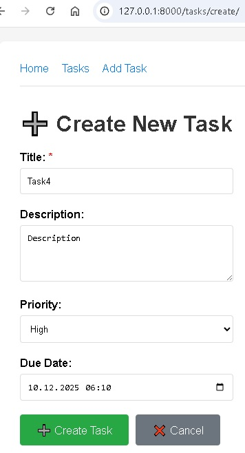
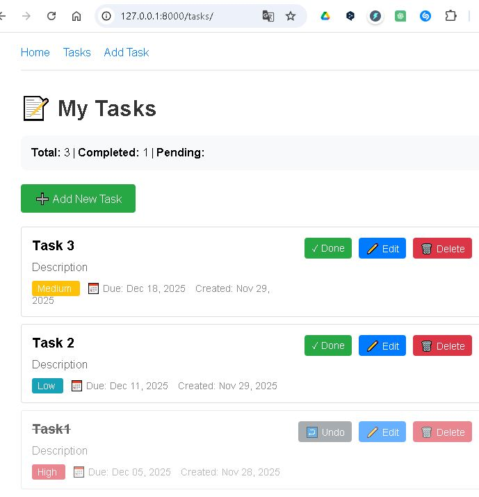

# Homework 01. Introduction to AI-Assisted Development 

In this homework, we'll build an application with AI.

You can use any tool you want: ChatGPT, Claude, GitHub Copilot, Codex, Cursor, Antigravity, etc.

With chat-based applications you will need to copy code back-and-forth, so we recommend that you use an AI assistant in your IDE with agent mode.

We will build a TODO application in Django.

The app should be able to do the following:

- Create, edit and delete TODOs 
- Assign due dates
- Mark TODOs as resolved

You will only need Python to get started (we also recommend that you use `uv`).

You don't need to know Python or Django for doing this homework.


## Question 1: Install Django

We want to install Django. Ask AI to help you with that.

What's the command you used for that?

There could be multiple ways to do it. Put the one that AI suggested in the homework form.

```bash
# 1. Create and navigate to your project directory
cd /D/AI-Tools-Zoomcamp/Homework01

# 2. Initialize uv project (if not done)
uv init

# ANSWER 1: 3. Add Django
uv add django

# 4. Create Django project using module syntax
uv run python -m django startproject myproject .

# 5. Verify it worked
ls
# You should see: manage.py and myproject/ directory
D:.
│   .python-version
│   main.py
│   manage.py
│   pyproject.toml
│   README.md
│   uv.lock
│   
├───.venv
│   │   .gitignore
│   │       ...
│   ├───Lib
│   │   └───site-packages
│   │       │   _virtualenv.pth
│   │       ...     
│   └───Scripts
│           activate
│           ...
│           
└───myproject
        asgi.py
        settings.py
        urls.py
        wsgi.py
        __init__.py
```

## Question 2: Project and App

Now we need to create a project and an app for that.

Follow the instructions from AI to do it. At some point, you will need to include the app you created in the project.

What's the file you need to edit for that?

- `settings.py`
- `manage.py`
- `urls.py`
- `wsgi.py`

```bash
# Create an app called "myapp"
uv run python manage.py startapp myapp

# After running this, the structure will look like:
D:.
│   manage.py
│   ...
├───myproject
│       settings.py
│       urls.py
│       wsgi.py
│       __init__.py
│
└───myapp          # <-- New app directory
        admin.py
        apps.py
        models.py
        tests.py
        views.py
        __init__.py
```

```python
# ANSWER 2: We need to edit myproject/settings.py to include your newly created app.
# Open myproject/settings.py and find the INSTALLED_APPS list (around line 33). Add our app:

# Edit myproject/settings.py

INSTALLED_APPS = [
    'django.contrib.admin',
    'django.contrib.auth',
    'django.contrib.contenttypes',
    'django.contrib.sessions',
    'django.contrib.messages',
    'django.contrib.staticfiles',
    'myapp',  # <-- Add this line
]
```

## Question 3: Django Models

Let's now proceed to creating models - the mapping from python objects to a relational database. 

For the TODO app, which models do we need? Implement them.

What's the next step you need to take?

- Run the application
- Add the models to the admin panel
- Run migrations
- Create a makefile

```
ANSWER 3: Run migrations
After creating models, we need to run migrations to:
1. Create the database schema based on our models
2. Generate the actual database tables
3. Make our models functional
```
```bash
# Step 1. Create the model (done in myapp/models.py)

# Step 2: Create migration files (tells Django what changed)
uv run python manage.py makemigrations
# Expected output:
# Migrations for 'myapp':
#   myapp/migrations/0001_initial.py
#     - Create model Task

# Step 3: Apply migrations (creates the actual database tables)
uv run python manage.py migrate
# Expected output:
# Operations to perform:
#   Apply all migrations: admin, auth, contenttypes, myapp, sessions
# Running migrations:
#   Applying myapp.0001_initial... OK
```

## Question 4. TODO Logic

Let's now ask AI to implement the logic for the TODO app. Where do we put it? 

- `views.py`
- `urls.py`
- `admin.py`
- `tests.py`

```
ANSWER 4: views.py
Views contain the business logic and handle the application's behavior. Views (views.py) is where we implement:
- Business logic
- Request handling
- Database operations (CRUD)
- Data processing
- Response generation (HTML, JSON, etc.)
```

## Question 5. Templates

Next step is creating the templates. You will need at least two: the base one and the home one. Let's call them `base.html` and `home.html`.

Where do you need to register the directory with the templates? 

- `INSTALLED_APPS` in project's `settings.py`
- `TEMPLATES['DIRS']` in project's `settings.py`
- `TEMPLATES['APP_DIRS']` in project's `settings.py`
- In the app's `urls.py`

```
ANSWER 5: TEMPLATES['DIRS'] in project's settings.py
When we create custom template directories (especially project-level templates), 
we need to register them in the TEMPLATES['DIRS'] setting so Django knows where to find them.
```

```bash
# Step 1: Create Template Directory Structure
# Create templates directory in your project root
mkdir -p templates/myapp

# Our structure should look like:
F:.
├── templates/
│   ├── base.html
│   ├── home.html
│   └── myapp/
│       ├── task_list.html
│       ├── task_form.html
│       └── task_confirm_delete.html
├── myproject/
│   └── settings.py
└── myapp/
```

```bash
# Step 2: Register Templates Directory in settings.py

```


## Question 6. Tests

Now let's ask AI to cover our functionality with tests.

- Ask it which scenarios we should cover
- Make sure they make sense
- Let it implement it and run them 

Probably it will require a few iterations to make sure that tests pass and evertyhing is working. 

What's the command you use for running tests in the terminal? 

- `pytest`
- `python manage.py test`
- `python -m django run_tests`
- `django-admin test`

```
ANSWER 6: python manage.py test
This is Django's built-in test runner that:  
1. Discovers all tests in your project
2. Creates a test database
3. Runs all tests
4. Cleans up the test database
5. Reports results
```

```bash
# Run all tests
uv run python manage.py test

# Run tests for a specific app
uv run python manage.py test myapp

# Run a specific test class
uv run python manage.py test myapp.tests.TaskModelTestCase

# Run a specific test method
uv run python manage.py test myapp.tests.TaskModelTestCase.test_task_creation

# Run tests with verbosity
uv run python manage.py test --verbosity=2

# Keep test database (useful for debugging)
uv run python manage.py test --keepdb
```

### Expected Output:
```bash
$ uv run python manage.py test
Found 21 test(s).
Creating test database for alias 'default'...
System check identified no issues (0 silenced).
.....................
----------------------------------------------------------------------
Ran 21 tests in 0.085s

OK
Destroying test database for alias 'default'...
```

```bash
$ uv run python manage.py test myapp
Found 21 test(s).
Creating test database for alias 'default'...
System check identified no issues (0 silenced).
.....................
----------------------------------------------------------------------
Ran 21 tests in 0.095s

OK
Destroying test database for alias 'default'...
```


## Running the app

Now the application is developed and tested. Run it:

```bash
python manage.py runserver
# For uv:
uv run python manage.py runserver
```

Since we asked AI to test everything, it should just work. If it doesn't, iterate with AI until it works. 

## Screenshots

### Add Task



### Task List



## Homework URL

Commit your code to GitHub. You can create a repository for this course. Within the repository, create a folder, e.g. "01-todo", where you put the code.

Use the link to this folder in the homework submission form. 
